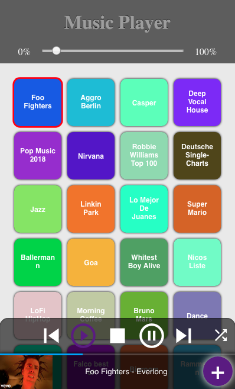
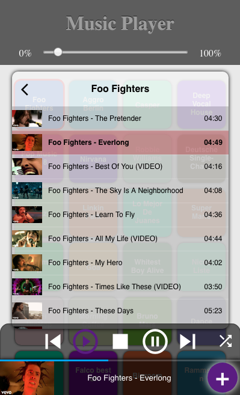

# yt-music-player

A music player which can be controlled using a web interface based on websockets. This is still a work in progress!
I started developing this project because I needed a simple and easy-to-use music player for my Raspberry Pi.

It works, but might still have a lot of bugs and the webclient is a quick-and-dirty one.

Currently the player supports only youtube tracks and playlists. Feel free to add support for more services!
<p align="center">
&nbsp;&nbsp;
</p>

### Youtube Plugin:
- Uses [`mpv` player](https://mpv.io) in socket mode (using `--input-ipc-server=/tmp/mpvsocket`)
- Uses `youtube-dl` to fetch playlist and video information

## Setup
- First: ``sudo apt-get update && sudo apt-get upgrade``
- Install necessary packages: ``sudo apt-get install -y python python3-pip mpv socat libboost-all-dev``
- Install youtube-dl: ``pip install youtube-dl``
- Go to directory of the repository: ``git clone https://github.com/Neeco1/yt-music-player`` and ``cd yt-music-player``
- ``mkdir build && cd build``
- ``cmake ..``
- ``make``
- ``./MusicPlayerService`` (or run it in a [`screen`](https://wiki.ubuntuusers.de/Screen/) to put it in background)

## Setup of a systemctl entry

```
# Create a systemctl configuration file for musicplayer
sudo nano /etc/systemd/system/musicplayer.service
```

Input this into the file:
```
[Unit]
Description=musicplayer
After=network.target

[Service]
ExecStart=/home/username/repository/build/MusicPlayerService
WorkingDirectory=/home/username/repository/build/
StandardOutput=inherit
StandardError=inherit
Restart=always
User=pi

[Install]
WantedBy=multi-user.target
```

Test and then enable the service by using:
```
# Start the service
sudo systemctl start musicplayer
# Check the status
systemctl status musicplayer
# Enable it
sudo systemctl enable musicplayer.service

# For stopping, you call
sudo systemctl stop musicplayer

# Viewing the log of musicplayer
sudo journalctl -u musicplayer.service -f
```

## Developers

### Websocket API for Communication

```
{
    "cmd" : "<command>",
    "data" : {}
}
```

Supported commands:
* stop
* play
* pause
* set_volume
* get_volume
* get_playlists
* get_playlist
* add_playlist
* update_playlists
* select_playlist
* play_track_from_list
* set_playback_mode
* get_playback_info
* nextTrack
* previousTrack
* setPlaybackTime
* play_media_from_url
* update_yt_dl

For details, see the file [WebSocketPlayer.cpp](https://github.com/Neeco1/yt-music-player/blob/master/src/WebSocketPlayer.cpp)

## TODO
